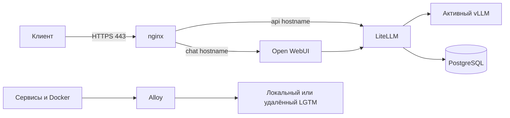

# AI vLLM Stack

OpenAI-совместимый стек для локальных vLLM-моделей. Клиентам публикуется один порт `443` с двумя именами: API и чат.



| Компонент | Роль | Обязателен |
|---|---|---|
| vLLM | inference-движок, OpenAI-совместимый API | да |
| LiteLLM | virtual keys, лимиты, учёт, стабильное имя модели | да |
| PostgreSQL | хранилище ключей и usage LiteLLM | да |
| nginx | единственный внешний HTTPS-вход на 443, срез админских путей | да для пилота |
| Open WebUI | чат-интерфейс | нет |
| Alloy + LGTM | метрики, логи, трейсы локально или в удалённый мониторинг | нет |
| NVIDIA GPU Exporter | GPU-метрики | нет |

Подробно, зачем нужен каждый компонент и что сломается без него — в [docs/architecture.md](docs/architecture.md).

Основной стенд — Ubuntu по SSH. Windows 11 + Docker Desktop/WSL2 — локальный пилот.

## Какой сценарий выбрать

Если сомневаетесь — берите первую строку. Это дефолт, с него начинают все.

| Ваша ситуация | Команды | Почему |
|---|---|---|
| **Первый запуск, разбираетесь со стеком** | `observability local` + `gateway internal` | всё на одном хосте, сертификат выпускается сам, внешних зависимостей нет |
| Мониторинг заказчика ещё не готов | `observability off` + `gateway internal` | стек обслуживает запросы, телеметрию подключите позже без перезапуска моделей |
| Есть адреса удалённого LGTM | `observability remote` | на хосте только Alloy: меньше RAM, диска и обслуживания |
| Есть сертификат от корпоративного CA | `gateway external` | клиентам не нужно ставить root CA вручную |
| Меняются DNS-имена и сертификат сразу | `gateway migration` | старые и новые имена работают параллельно на одном 443 |

Слот модели: начинайте с `start main`. Слот `alt` — второй, для параллельной или сменной модели, трогать его сразу не нужно.

## Быстрый старт

Ubuntu:

```bash
cp .env.example .env
chmod 600 .env
# замените все CHANGE_ME; OPEN_WEBUI_LITELLM_KEY оставьте пустым
./model.sh preflight
./model.sh observability local
./model.sh start main --gpu-metrics
./model.sh gateway internal
./model.sh status
```

Windows:

```powershell
Copy-Item .env.example .env
# замените все CHANGE_ME; OPEN_WEBUI_LITELLM_KEY оставьте пустым
.\model.ps1 preflight
.\model.ps1 observability local
.\model.ps1 start main -GpuMetrics
.\model.ps1 gateway internal
.\model.ps1 status
```

> **`observability local` — это первый шаг развёртывания, а не опция.** Помимо Prometheus/Loki/Tempo/Grafana команда поднимает PostgreSQL, LiteLLM, Open WebUI и Alloy. Пропустить её нельзя: в режиме `remote` вместо неё выполняется `observability remote`.

**Первый запуск модели занимает 10–30 минут**: качается ~4 GiB весов, затем модель грузится в VRAM. Состояние `health: starting` в это время нормально. Следите за прогрессом:

```bash
docker compose --profile main logs -f vllm-main
```

После старта LiteLLM создайте ограниченный virtual key для Open WebUI, запишите в `OPEN_WEBUI_LITELLM_KEY` и пересоздайте только `open-webui`. Master key в WebUI не передавайте. Подробности — в инструкциях установки и [ИБ-чеклисте](docs/security-checklist.md).

Сертификаты заказчика кладите по образцу [secrets.example/tls](secrets.example/tls/README.md). Каталог `secrets/` в Git не хранится. В режиме `gateway internal` туда же выпускается локальный CA: корневой сертификат для клиентов — `secrets/tls/internal-ca.crt`.

## Документация

| Документ | Назначение |
|----------|------------|
| [docs/architecture.md](docs/architecture.md) | Схемы, зачем нужен каждый компонент, матрица режимов |
| [docs/install-ubuntu-ssh.md](docs/install-ubuntu-ssh.md) | Установка Ubuntu по SSH |
| [docs/install-windows.md](docs/install-windows.md) | Локальная установка Windows 11 |
| [docs/troubleshooting.md](docs/troubleshooting.md) | Что делать, когда не работает |
| [docs/quick-start-https.md](docs/quick-start-https.md) | Быстрый старт с internal CA |
| [docs/network-and-tls.md](docs/network-and-tls.md) | DNS, TLS, миграция, внешний сертификат |
| [docs/remote-observability.md](docs/remote-observability.md) | Local/remote observability |
| [docs/model-operations.md](docs/model-operations.md) | Замена, добавление и переключение моделей |
| [docs/security-checklist.md](docs/security-checklist.md) | ИБ-чеклист перед данными заказчика |
| [docs/verification.md](docs/verification.md) | Команды приёмки, которые выполняет оператор |
| [examples/api.http](examples/api.http) | Справочник по запросам к API |

## Команды

```bash
./model.sh preflight                       # проверить готовность хоста до запуска
./model.sh observability local|remote|off  # поднять базовый стек + телеметрию
./model.sh start main|alt [--gpu-metrics]  # один слот модели
./model.sh start-many main alt             # оба слота, требует ALLOW_CONCURRENT_MODELS=true
./model.sh stop                            # остановить модели, остальное оставить
./model.sh status                          # состояние всех профилей
./model.sh gateway internal|migration|external|status
```

PowerShell — те же команды в `.\model.ps1`, флаг `-GpuMetrics` вместо `--gpu-metrics`.

- `start` останавливает оба vLLM-слота перед запуском выбранного.
- `start-many` требует `ALLOW_CONCURRENT_MODELS=true` и не проверяет VRAM.
- `gateway migration`/`external` требуют файлы из `TLS_CERTS_DIR`, проверяют, что ключ читается под UID 101, и прогоняют `nginx -t` перед запуском.
- `gateway internal`/`migration` выпускают сертификат локального CA в `TLS_CERTS_DIR`. Ключ CA переиспользуется, leaf перевыпускается при смене имён или за 30 дней до истечения.
- `observability remote` требует заполненные `REMOTE_*` URL и токены; локальные LGTM останавливаются, volumes сохраняются.
- Команды `gateway` и `observability` записывают выбранный режим обратно в `.env`, чтобы прямой `docker compose up` его не откатывал.

## Матрица режимов

| Режим | Что работает на хосте | Когда применять |
|---|---|---|
| `observability local` | весь стек + Prometheus, Loki, Tempo, Grafana | нет внешнего мониторинга |
| `observability remote` | весь стек + только Alloy | есть удалённый LGTM заказчика |
| `observability off` | весь стек без телеметрии | endpoints мониторинга ещё неизвестны |
| `gateway internal` | nginx с сертификатом локального CA | пилот, быстрый старт |
| `gateway migration` | старые имена на internal CA, новые на внешнем сертификате | окно смены DNS |
| `gateway external` | сертификат заказчика на обоих именах | постоянная эксплуатация |

## Важные ограничения

- Одновременно одна модель — безопасный default для 12 GB VRAM.
- Слотов из коробки два (`main`, `alt`). Слоты выводятся из профилей Compose, поэтому третий добавляется правкой только `compose.yaml` и `config/litellm.yaml` — скрипты менять не нужно, см. [model-operations.md](docs/model-operations.md).
- Образ vLLM закреплён релизным тегом, модель — неизменяемым commit'ом. Обновляйте по одному фактору за раз: образ **или** модель, никогда оба сразу.
- Развёртывание, firewall, DNS, trust stores и приёмку выполняет оператор по [docs/verification.md](docs/verification.md).
- `LITELLM_SALT_KEY` после первого запуска не меняйте.
- Не используйте `docker compose down -v`, если нужны данные: это удалит ключи, чаты, телеметрию и приватный ключ internal CA.
