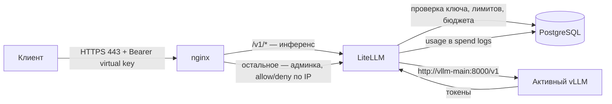
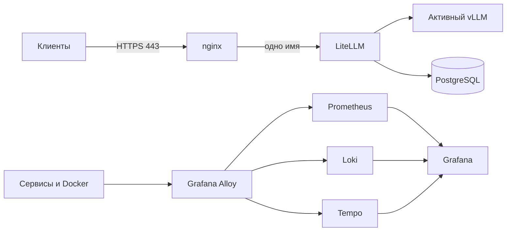
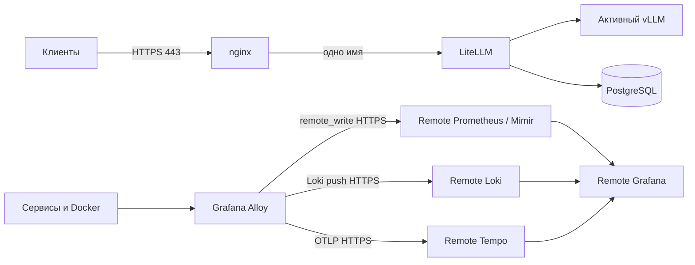

# Архитектура стека

Документ отвечает на три вопроса: что из чего состоит, зачем нужен каждый компонент и что можно не запускать.

Текстовая версия схем из [architecture.excalidraw](architecture.excalidraw). Если Excalidraw недоступен, используйте этот файл — он первичен.

## Путь одного запроса



Ключевое следствие: клиент никогда не разговаривает с vLLM напрямую. Между ними всегда два слоя — nginx (TLS и сетевое разграничение путей) и LiteLLM (аутентификация, лимиты и учёт).

## Режим `local`: всё на одном сервере



Автономный режим: внешний мониторинг не нужен, но стенд тяжелее на ~2–3 GiB RAM и растущие volumes. Grafana остаётся административным интерфейсом на `127.0.0.1:3001` и наружу не публикуется.

## Режим `remote`: на стенде только агент



Рекомендуемый режим для стенда заказчика: меньше RAM, диска и компонентов на обслуживании. Prometheus, Loki, Tempo и Grafana на стенде не запускаются, Alloy шлёт всё исходящими TLS-соединениями.

Приложения в обоих режимах всегда отправляют OTLP на `alloy:4317`. Меняются только sinks самого Alloy — поэтому переключение `local` → `remote` не требует трогать LiteLLM или перезапускать модель.

## Зачем нужен каждый компонент

| Компонент | Зачем он здесь | Что сломается без него | Обязателен |
|---|---|---|---|
| **vLLM** | Собственно inference-движок. Отдаёт OpenAI-совместимый API на внутреннем `:8000` | Ничего не работает | Да |
| **LiteLLM** | Virtual keys с model allowlist, RPM/TPM и бюджетом; стабильное API-имя модели при смене слота; учёт usage; метрики и трейсы | Клиенты идут прямо в vLLM с одним общим `VLLM_API_KEY`: нельзя отозвать доступ одному клиенту, нет учёта, нет лимитов, смена модели ломает клиентов | Да |
| **PostgreSQL** | Хранилище virtual keys и spend logs LiteLLM | Ключи и учёт не переживут рестарт LiteLLM | Да |
| **nginx** | Единственный вход на 443. Терминирует TLS и разделяет доступ: `/v1/*` открыт всем, кто дотянулся до имени, административные пути ограничены `ADMIN_ALLOW_CIDR` | Управляющий API LiteLLM без TLS и без сетевого ограничения | Да для пилота, нет для локальной отладки |
| **Alloy** | Один агент собирает три сигнала (метрики scrape, Docker-логи, OTLP-трейсы) и умеет писать либо в локальный LGTM, либо в удалённый — без правки приложений | Нет наблюдаемости. Приложения продолжат работать, но OTLP-экспорт будет писать ошибки в логи | Нет |
| **Prometheus / Loki / Tempo** | Локальное хранение метрик / логов / трейсов | В режиме `local` Alloy некуда писать | Нет, если режим `remote` |
| **Grafana** | Просмотр локального LGTM | Нет дашбордов. Данные продолжат собираться | Нет |
| **NVIDIA GPU Exporter** | Температура, VRAM, утилизация карты как метрики | Нет GPU-метрик. Останутся метрики самого vLLM (KV-cache, очередь) | Нет |

### Почему LiteLLM, если у vLLM уже есть API и `--api-key`

Это самый частый вопрос. У vLLM ровно один общий ключ на процесс. Практические следствия: нельзя выдать двум клиентам разные ключи и отозвать один; нет учёта расхода токенов; нет лимитов RPM/TPM; при переключении `main` → `alt` меняется имя модели, и клиентские конфиги ломаются. LiteLLM закрывает всё четыре пункта и добавляет `/metrics` для Prometheus.

## Минимальный набор

Для проверки «модель вообще отвечает» достаточно трёх сервисов:

```bash
docker compose --profile main up -d postgres litellm vllm-main
curl -H "Authorization: Bearer $LITELLM_MASTER_KEY" http://127.0.0.1:4000/v1/models
```

Всё остальное — nginx, Alloy, LGTM — добавляется поверх и не требуется для inference. Это полезно при диагностике: если минимальный набор работает, а через 443 нет — проблема в nginx/DNS/TLS, а не в модели.

## Матрица режимов

| Команда | Что поднимает | Когда применять |
|---|---|---|
| `observability local` | Postgres, LiteLLM, Alloy **+** Prometheus, Loki, Tempo, Grafana | Стенд без внешнего мониторинга |
| `observability remote` | Alloy с `config.remote.alloy`; останавливает локальные LGTM | Есть удалённый LGTM заказчика |
| `observability off` | Останавливает Alloy и локальные LGTM; обслуживание не трогает | Адреса мониторинга ещё неизвестны |
| `start main` \| `start alt` | Выбранный слот vLLM (и базовые сервисы) | Всегда, после observability |
| `start-many main alt` | Оба слота сразу; требует `ALLOW_CONCURRENT_MODELS=true` | Только при доказанном запасе VRAM |
| `gateway internal` | nginx с самоподписанным internal CA | Быстрый старт, пилот |
| `gateway migration` | nginx: старые имена на internal CA, новые на внешнем сертификате | Окно смены DNS-имён |
| `gateway external` | nginx на сертификате заказчика | Постоянная эксплуатация |

> **Важно.** `observability local` и `observability remote` поднимают не только телеметрию. Любая команда `docker compose up` без фильтра сервисов стартует все сервисы **без профиля** — то есть PostgreSQL и LiteLLM. Поэтому `observability` — это первая команда развёртывания, а не опциональный шаг.

Сервисы под профилями стартуют только по явному запросу:

| Профиль | Сервисы | Кто включает |
|---|---|---|
| `telemetry` | alloy | `observability local` и `remote` |
| `local-observability` | prometheus, loki, tempo, grafana | `observability local` |
| `main` / `alt` | vllm-main / vllm-alt | `start`, `start-many` |
| `gpu-metrics` | nvidia-gpu-exporter | флаг `--gpu-metrics` |
| `gateway` | nginx | `gateway <mode>` |

Alloy вынесен в профиль намеренно: иначе `observability off` откатывался бы обратно при следующем `start main`.

## Сети и границы

```text
edge     : nginx, litellm
backend  : litellm, vllm-*, postgres, alloy, prometheus, loki, tempo, grafana
```

nginx находится **только** в `edge`. У него нет сетевого маршрута к PostgreSQL, Alloy, Docker socket и хранилищам телеметрии. LiteLLM стоит в обеих сетях, потому что принимает трафик от nginx и ходит в backend.

Наружу опубликован один порт: `${PUBLIC_BIND_ADDRESS}:${PUBLIC_HTTPS_PORT}` → nginx. Все диагностические порты (LiteLLM 4000, vLLM 8001/8002, Grafana 3001, Prometheus 9090, Alloy 12345) привязаны к `127.0.0.1` и доступны только через SSH tunnel.

Docker-сеть сама по себе не является границей безопасности, если сервис публикует host port. Проверяйте фактические привязки: `docker compose config` и `ss -lntp`.

## Потребление ресурсов

Размеры образов ниже **измерены** на Docker Desktop/WSL2 для версий из `.env.example`. RAM и VRAM зависят от нагрузки — снимите свои значения командами ниже.

| Слой | Образы (факт) | Из чего складывается |
|---|---|---|
| core: Postgres + LiteLLM + Alloy + nginx | **~2.0 GiB** | LiteLLM 1.16 + Alloy 0.54 + Postgres 0.30 + nginx 0.05 |
| `+ local-observability` | **+1.7 GiB** | Grafana 1.16 + Prometheus 0.30 + Loki 0.12 + Tempo 0.12 |
| `+ vLLM` и GPU exporter | **+19.8 GiB** | образ vLLM 19.7 — самая тяжёлая позиция стека |
| кэш модели Qwen3.5-4B-AWQ | **+~5.8 GiB** | `data/huggingface`, вне образов |

Итого для полного стенда с одной моделью: **~29 GiB** образов и весов до того, как начнут расти volumes телеметрии. Отсюда требование в 60 GiB — запас нужен на вторую revision модели при обновлении и на Prometheus/Loki/Tempo.

Оперативная память, замерено на простое при одной загруженной модели:

| Слой | RAM | Крупнейшие потребители |
|---|---|---|
| core | **~1.2 GiB** | LiteLLM 873 MiB + Alloy 242 MiB + Postgres 59 MiB + nginx 12 MiB |
| `+ local-observability` | **+0.7 GiB** | Tempo 326 MiB + Grafana 184 MiB + Loki 110 MiB + Prometheus 100 MiB |
| `+ vLLM` и GPU exporter | **+5.1 GiB** | процесс vLLM 5.10 GiB |
| **итого** | **~7.0 GiB** | под нагрузкой выше |

VRAM считается отдельно: `Qwen3.5-4B-AWQ` при `gpu-memory-utilization=0.85` занимает около 11.1 GiB из 12.3 GiB карты вместе с KV-кэшем. nginx — самый дешёвый сервис стека и по образу, и по памяти.

Как снять фактические значения на своём стенде:

```bash
docker stats --no-stream
docker system df -v
nvidia-smi --query-gpu=memory.used,memory.total --format=csv
du -sh data/huggingface
```

Retention локального Prometheus ограничен `PROMETHEUS_RETENTION_TIME=30d` и `PROMETHEUS_RETENTION_SIZE=10GB`; Docker-логи — `DOCKER_LOG_MAX_SIZE`/`DOCKER_LOG_MAX_FILES`. Loki и Tempo растут без верхнего предела в этой конфигурации — следите за диском.

## Что осознанно не входит в пилот

Kubernetes, Swarm, Terraform/Ansible, Vault, service mesh, HA, Alertmanager, DCGM Exporter и автоматические backup jobs. Для одиночного небольшого стенда они добавляют больше точек отказа и стоимости сопровождения, чем пользы. Бесшовного failover моделей тоже нет: одна GPU и взаимоисключающие профили означают плановый простой при переключении.

## Дальше

- Развернуть: [install-ubuntu-ssh.md](install-ubuntu-ssh.md) или [install-windows.md](install-windows.md)
- Не запускается: [troubleshooting.md](troubleshooting.md)
- Добавить или заменить модель: [model-operations.md](model-operations.md)
- Сеть, TLS, миграция: [network-and-tls.md](network-and-tls.md)
